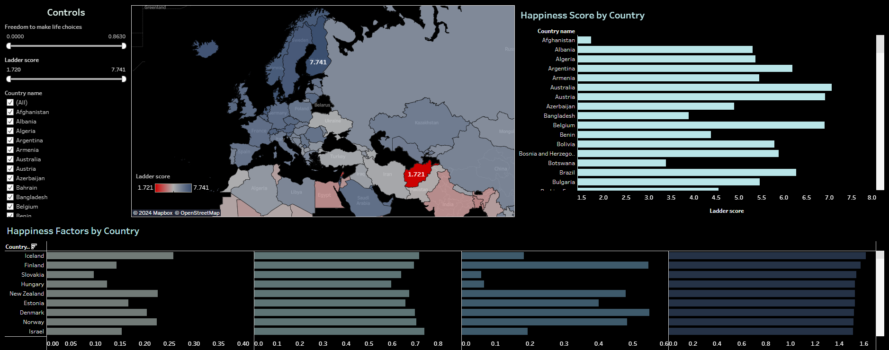

<h1 align="center">
     🌎 World Happiness (2024) Dashboard in Tableau
       
      

     📊 Data Visualization
</h1>
<h3>📚 About Data</h3>

The dataset includes the following columns:

<ul>
<li><b>Country Name:</b> Name of the country.</li>
<li><b>Regional Indicator:</b> Region where the country is located.</li>
<li><b>Ladder Score:</b> Happiness score based on a scale from 0 (worst) to 10 (best).</li>
<li><b>Upper/Lower Whisker:</b> Confidence bounds for the happiness score.</li>
<li><b>Log GDP per Capita:</b> Adjusted GDP per capita (PPP).</li>
<li><b>Social Support:</b> Average response to having friends/relatives for support.</li>
<li><b>Healthy Life Expectancy:</b> Expected years of good health at birth.</li>
<li><b>Freedom to Make Life Choices:</b> Average response on freedom of choice in life.</li>
<li><b>Generosity:</b> Residual score from charity donation responses.</li>
<li><b>Perceptions of Corruption:</b> Average response to perceived corruption.</li>
<li><b>Dystopia + Residual:</b> Benchmark combining a hypothetical “least happy” country with unexplained residuals.</li>
<li><b>Positive/Negative Affect:</b> Average responses to positive or negative emotions experienced.</li>
</ul>

📠The dataset is available via the following link: <a href="https://www.kaggle.com/datasets/jainaru/world-happiness-report-2024-yearly-updated">Kaggle Link</a>.

📠Live Dashboard: <a href="https://public.tableau.com/views/WorldHappinessin2024/Dashboard1?:language=en-US&:sid=&:redirect=auth&:display_count=n&:origin=viz_share_link">Tableau Link</a>

  
<h3>📌 Objectives</h3>

Using Tableau, a dashboard was created to visualize: 

<ul>
  <li><b>Happiness Score by Country:</b> Highlighting the happiness levels across nations.</li>
  <li><b>Happiness Factors by Country:</b> Displaying averages for key contributors such as Generosity, Healthy Life Expectancy, Perceptions of Corruption, and Social Support.</li>
</ul>

This dashboard helps identify trends, regional differences, and the impact of various factors on happiness.

<h3>Conclusion</h3>

<b>Afghanistan</b> has the lowest happiness score of <b>1.721</b>, followed by <b>Lebanon with 2.707</b>. A key reason for these low scores is the significantly lower average values for factors such as Generosity, Healthy Life Expectancy, Perceptions of Corruption, and Social Support, compared to <b>Finland</b>, the happiest country with a score of <b>7.741</b>.

Notably, <b>Afghanistan's Social Support</b> is recorded as <b>0</b>, indicating a complete lack of support systems, which is a critical contributor to its low happiness level. This stark contrast with Finland, where all these factors have much higher averages, underscores the essential role of social infrastructure and trust in fostering happiness.

